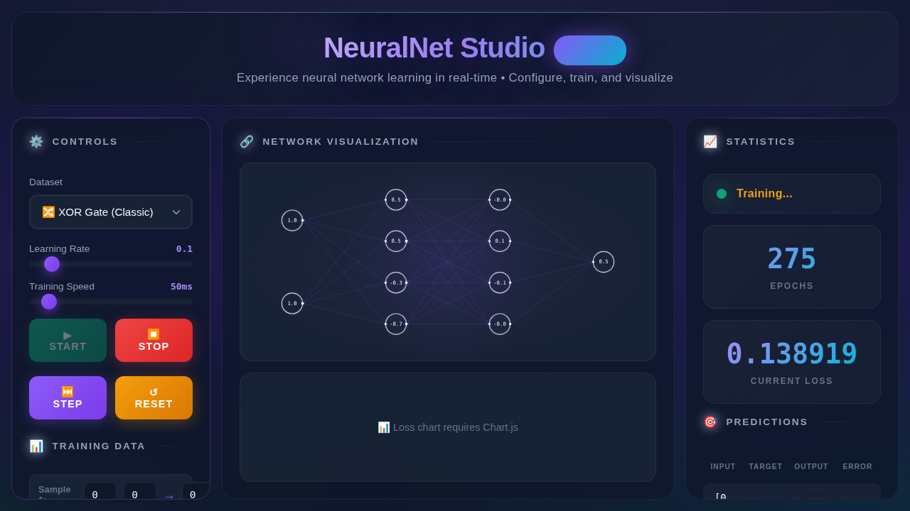

# NeuralNetJS

A beautiful, interactive neural network learning visualization platform. Watch neural networks learn in real-time with stunning visuals and intuitive controls.



## Features

- 🧠 **Real-time Learning Visualization** - Watch neural network weights and activations update during training
- 🎛️ **Interactive Controls** - Adjust learning rate, training speed, and dataset on the fly
- 📊 **Live Statistics** - Monitor epochs, loss, and per-sample predictions
- 🎨 **Award-Winning Design** - Modern glassmorphism UI with smooth animations
- 📱 **Responsive** - Works on desktop, tablet, and mobile devices

## Quick Start

### Local Development

Simply open `examples/basics.html` in your browser, or serve with any HTTP server:

```bash
# Using Python
python3 -m http.server 8080

# Using Node.js
npx serve .

# Using PHP
php -S localhost:8080
```

Then visit `http://localhost:8080/examples/basics.html`

## Deployment

### Docker Compose

The easiest way to deploy NeuralNetJS:

```bash
# Build and start the container
docker-compose up -d

# View logs
docker-compose logs -f

# Stop the container
docker-compose down
```

The application will be available at `http://localhost:8080`

### Kubernetes

Deploy to a Kubernetes cluster using the provided manifests:

```bash
# Apply all resources using kustomize
kubectl apply -k k8s/

# Or apply individually
kubectl apply -f k8s/namespace.yaml
kubectl apply -f k8s/deployment.yaml
kubectl apply -f k8s/ingress.yaml
kubectl apply -f k8s/hpa.yaml

# Check deployment status
kubectl get pods -n neuralnetjs
kubectl get svc -n neuralnetjs

# Access via port-forward (for local testing)
kubectl port-forward -n neuralnetjs svc/neuralnetjs-service 8080:80
```

#### Building the Docker Image

Before deploying to Kubernetes, build and push the Docker image:

```bash
# Build the image
docker build -t neuralnetjs:latest .

# Tag for your registry
docker tag neuralnetjs:latest your-registry/neuralnetjs:latest

# Push to registry
docker push your-registry/neuralnetjs:latest
```

Update `k8s/deployment.yaml` with your image registry path.

## Project Structure

```
NeuralNetJS/
├── examples/
│   └── basics.html      # Main interactive demo
├── src/
│   ├── Network.js       # Neural network implementation
│   ├── Layer.js         # Layer classes (Input, Hidden, Output)
│   ├── Neuron.js        # Neuron class with activation
│   └── NetworkGraph.js  # SVG visualization renderer
├── k8s/                  # Kubernetes manifests
│   ├── namespace.yaml
│   ├── deployment.yaml
│   ├── ingress.yaml
│   ├── hpa.yaml
│   └── kustomization.yaml
├── Dockerfile
├── docker-compose.yml
├── nginx.conf
└── README.md
```

## License

MIT